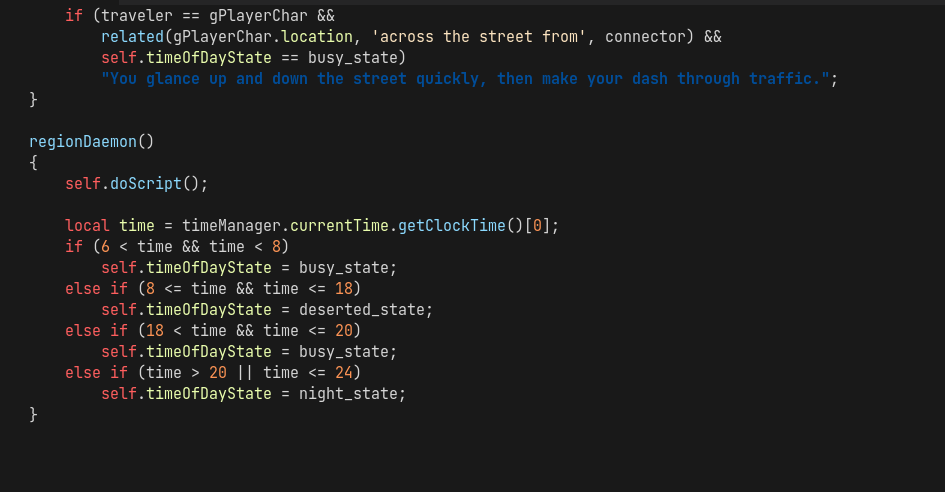
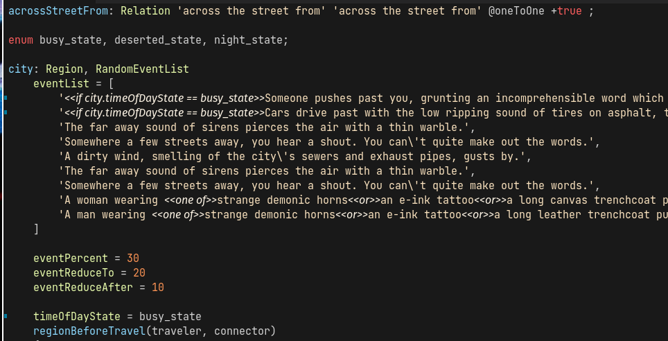
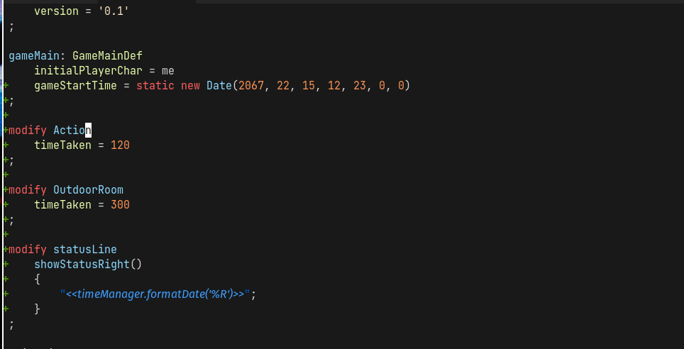
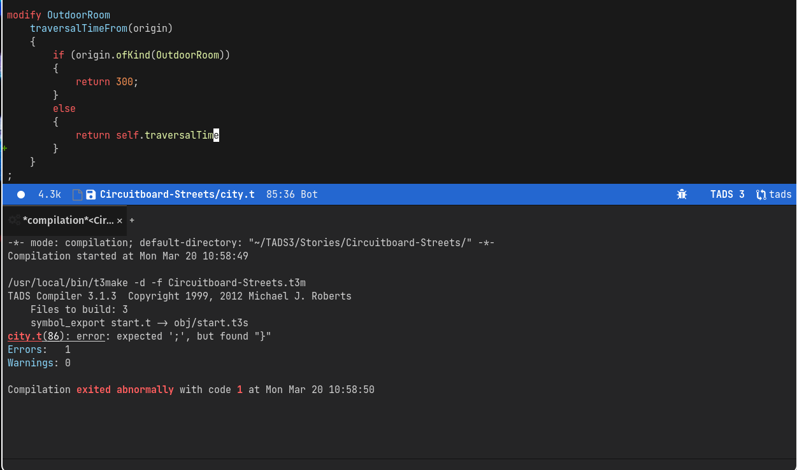
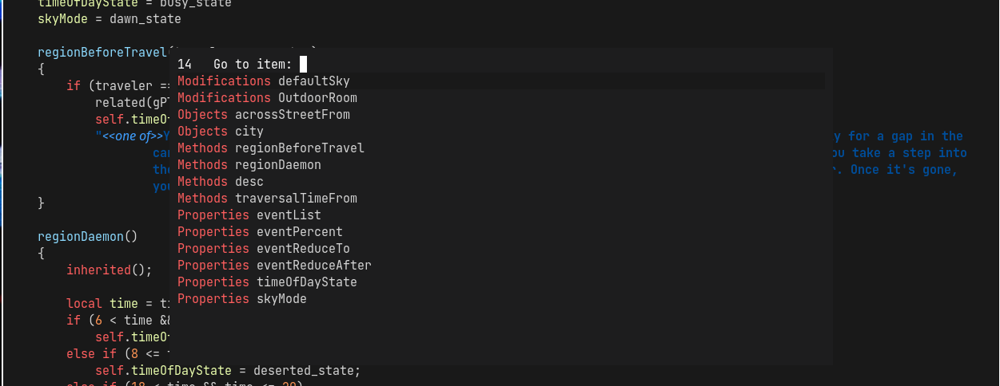
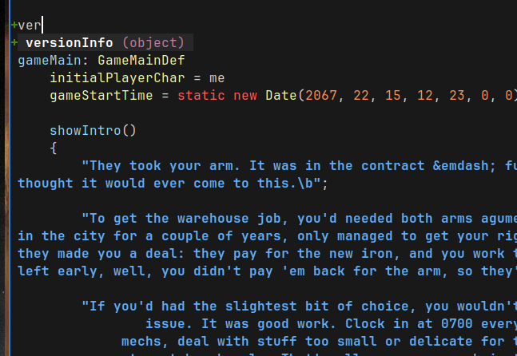
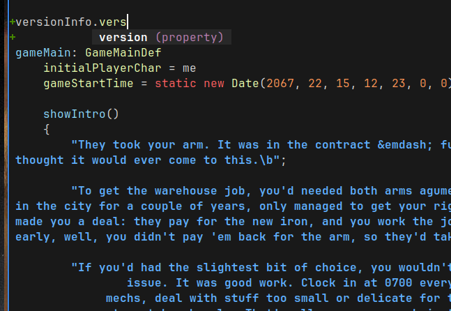
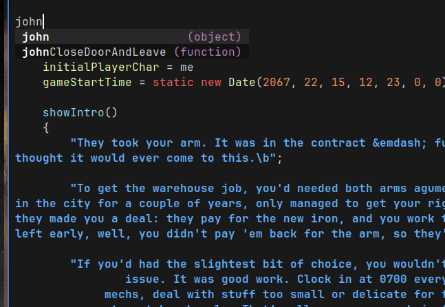

# tads3-mode

This TADS 3 Emacs mode was modified by Alexis Purslane <alexispurslane@pm.me>
from Brett Witty <brettwitty@brettwitty.net>'s modification of Stephen Granade's
tads2-mode.el to support TADS 3.

This version of the plugin requires Emacs 28.1 (the latest, currently) or later.

## Changes my version adds:

- syntax highlighting for properties when they're being accessed using dot
  notation
- syntax highlighting for properties and variables when they're being set
- syntax highlighting for function and method names when they're being called or
  defined
- different syntax highlighting for double-quoted description strings than
  regular single quoted strings
- syntax highlighting for substitutions inside strings (only inside the strings,
  too, using Emacs' anchored highlighters) and are a different font (italic sans
  serif)
- syntax highlighting for class names (just based on whether it's an identifier
  that starts with an uppercase letter)
- syntax highlighting for numbers
- Some updates to make it compatible with versions of Emacs since v24 (it was
  erroring out)
- Clearer specification of what something is in the imenu list of objects,
  functions, modifications, etc.
- Updated code for modern Emacs Lisp
- An in-editor build system that lets you compile the project the current file
  belongs to, even if the project root is in a parent directory, with a single
  key combination, and puts the output of the compiler in a split window where
  you can click on errors to jump to them in your code.
- in-editor running in your interpreter of choice
- somewhat context-aware autocompletion generated from *all* of your project
  files and the libraries listed in your *t3m* build file whenever you save a
  new modification!

## Roadmap

### To finish v1.4
- [x] Compilation, Error-checking and jump-to-error
- [x] Add source file to t3m
- [x] Running the game in editor and refreshing it on build
- [ ] Running test scripts
- [ ] Spellcheck that knows how to deal with TADS text
- [ ] Word count that understands TADS text
- [ ] Strings viewer (the compiler can output all strings)
- [ ] Uploading the plugin to MELPA

### For 2.0

- [x] Autocompletetion
- [ ] Refactoring tools
- [ ] Documentation for thing at point

## Old Problems
- Multiline C-style comments like:
   /* This
      is
      a comment */
still have font-lock problems. Multiline font-locking is known to
be difficult.
- In such comments, an apostrophe (') will try to match with
something nonsense later on.
- You cannot move to sub-objects via tads-next-object.

## Installation

Installation is simple. `git clone` this repository somewhere in your load path
(somewhere under `~/.emacs.d/`) or add wherever you put it to your load path,
and then add this code to your configuration file (`init.el`, `config.el` under
DOOM, etc.):

```emacs-lisp
(autoload 'tads3-mode "tads3" "TADS 3 editing mode." t)
(setq auto-mode-alist
      (append (list (cons "\\.t$" 'tads3-mode))
              auto-mode-alist))
```

It's recommended that you also use a soft word wrap mode like `+word-wrap-mode`
with this plugin, since you'll be writing lots of long lines of text.

## Screenshots









